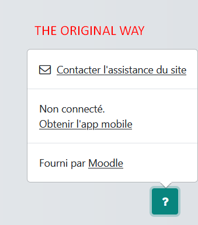
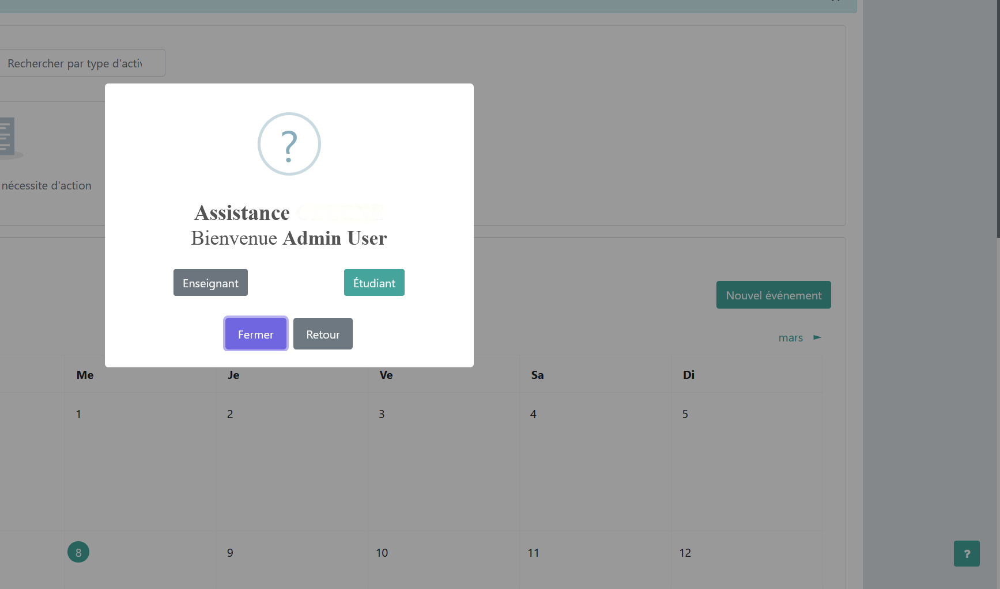
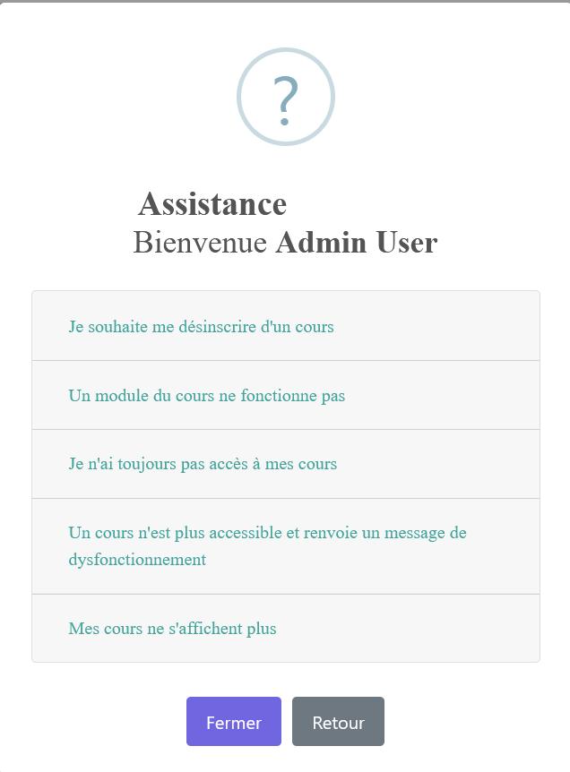

# Custom assistance popover

This snippet's ambition is to bypass the assistance popover (question mark button in the footer) without touching the core code.

## Requisites

- Moodle 4.x
- Boost child theme
- Grunt

### Before

### After

